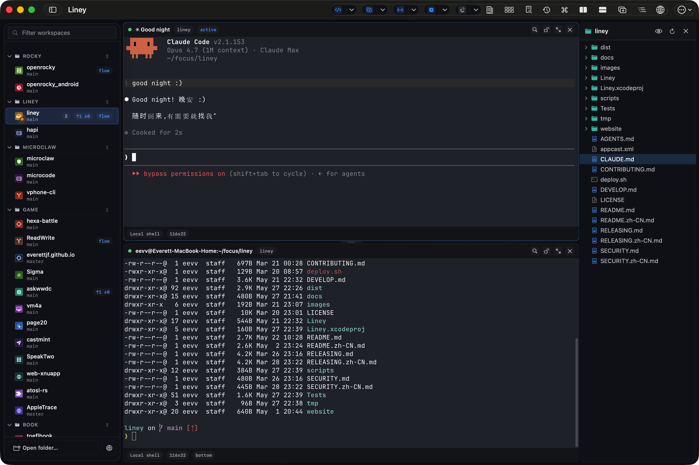

# Argo

A native macOS terminal workspace app built on AppKit + SwiftUI with a bundled Ghostty runtime. / 基于 AppKit + SwiftUI、内置 Ghostty 运行时的原生 macOS 终端工作区 app。

[中文版本](./README.zh-CN.md)

[](https://argo.dev)
[](https://code.devops.xiaohongshu.com/huying/Argo/-/releases)
[](https://argo.dev)
[](./LICENSE)

Argo is a native macOS terminal workspace app for developers who work across repositories, worktrees, branches, and split panes.

It gives you one focused place to open codebases, switch worktrees, keep terminal layouts around, and move faster without juggling a pile of Terminal windows.



## Why Use Argo

- Keep multiple repositories and worktrees in one sidebar.
- Reopen the same pane layout when you come back to a repo.
- Mix local shell, SSH, and agent-backed terminal sessions.
- Stay in a native macOS app built around keyboard-heavy workflows.

## Install

### Homebrew

```bash
brew update && brew install --cask argo
```

### Direct Download

Download the latest signed `.dmg` from GitLab Releases:

<https://code.devops.xiaohongshu.com/huying/Argo/-/releases>

## Quick Start

1. Open Argo.
2. Add one or more local repositories to the sidebar.
3. Select a repository or worktree and open a terminal tab.
4. Split panes as needed and switch worktrees without rebuilding your layout from scratch.

## Requirements

- macOS 14.6 or later
- Universal build: Apple Silicon and Intel Macs are both supported

## Links

- Website: <https://argo.dev>
- Docs: <https://argo.dev/docs/intro>
- Releases: <https://code.devops.xiaohongshu.com/huying/Argo/-/releases>
- Issues: <https://code.devops.xiaohongshu.com/huying/Argo/-/issues>
- Discord: <https://discord.com/invite/eGzEaP6TzR>

Power features:

- [Lifecycle hooks](https://argo.dev/docs/guides/lifecycle-hooks) — run a command when the app or a session starts/exits
- [Agent notifications](./docs/guides/agent-notifications.md) — `argo notify` CLI and OSC 9/777 sequences route through the dynamic island, scoped to the pane that fired them

## Branches

- `main` — development branch, may be unstable.
- `stable` — stable release branch. Use this if you need a reliable version of the source code.

## For Developers

Development setup, build commands, testing, repo layout, and release docs live in [`DEVELOP.md`](./DEVELOP.md).

## License

Released under the Apache License 2.0. See [`LICENSE`](./LICENSE).
