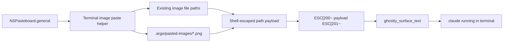

# Terminal Image Paste Design

## Goal

Enable image clipboard paste inside Argo terminal panes so users can copy a screenshot or image on macOS, press Paste in a terminal running `claude`, and have Claude Code receive a usable image file path.

The behavior should feel close to cmux: Argo handles the macOS image clipboard, persists the image to disk, and sends the resulting path through the terminal paste path.

## Scope

In scope:

- `Cmd+V` and Edit > Paste while an Argo Ghostty terminal pane is focused.
- Clipboard images represented as in-memory bitmap data, especially screenshots that arrive as TIFF/PNG.
- Finder-copied image files represented as file URLs.
- Shell-safe path insertion for the pasted image path.
- Bracketed paste wrapping so terminal programs see the input as a paste, not as ordinary typed characters.
- Focused unit tests for clipboard image extraction, path formatting, and paste payload generation.

Out of scope:

- New visual UI for previews, history, or attachment management.
- Uploading images to a service.
- Claude-specific private APIs.
- Changing the vendored Ghostty runtime.
- Remote file transfer for SSH/tmux sessions. The first implementation targets local and agent sessions where the saved local path is meaningful to the running process.

## User Experience

When the terminal is focused and the user pastes:

1. If the clipboard has normal text and no image content, Argo keeps the current Ghostty `paste_from_clipboard` behavior.
2. If the clipboard has a Finder-copied image file, Argo inserts the existing image path.
3. If the clipboard has in-memory image data, Argo writes it as a PNG file under the terminal working directory, then inserts that path.
4. The inserted path is shell-escaped and wrapped in bracketed paste markers:
   - begin: `ESC[200~`
   - end: `ESC[201~`

For multiple image file URLs, Argo inserts all shell-escaped paths separated by spaces. For multiple in-memory images, the initial implementation may save and insert the first image only, because macOS pasteboards normally expose screenshots as one image item.

## Architecture

Add a small terminal paste support helper near the existing terminal input/drop helpers. It should be independent of AppKit view state except for receiving an `NSPasteboard` and destination directory.

Responsibilities:

- Detect file URLs from the pasteboard using `readObjects(forClasses:options:)`.
- Filter file URLs to supported image extensions: `png`, `jpg`, `jpeg`, `gif`, `webp`, `heic`, `tif`, `tiff`, `bmp`.
- Detect in-memory images from pasteboard types such as PNG, TIFF, and generic image data.
- Convert in-memory image data to PNG using `NSBitmapImageRep`.
- Create `.argo/pasted-images/` below the terminal working directory.
- Generate collision-resistant filenames with timestamp plus a short UUID suffix.
- Return a paste payload string built from existing `shellEscaped` path formatting.
- Build bracketed paste text from a payload string.

`ArgoGhosttySurfaceView.paste(_:)` becomes:

- Only attempt image paste handling when `backendConfiguration.kind` is `.localShell` or `.agent`.
- Ask the helper for an image paste payload using `NSPasteboard.general` and the current local terminal working directory.
- If the helper returns text, send it with `sendText(bracketedPasteText)`.
- If there is no image payload, fall back to `performBindingAction("paste_from_clipboard")`.

The view already receives working-directory updates from Ghostty via `GHOSTTY_ACTION_PWD`. If the current directory is unavailable or not local, fall back to `launchConfiguration.workingDirectory`. For SSH and tmux backends, skip image paste handling and keep the current Ghostty paste behavior.

## Data Flow



## Error Handling

- If image decoding or PNG writing fails, do not partially send broken text.
- If there is also plain text on the pasteboard, fall back to normal text paste.
- If the pasteboard only contains unsupported non-text content, do nothing and preserve current behavior as much as possible.
- Directory creation failures should fail the image paste path and allow normal text paste fallback if text exists.

## Testing

Add focused unit tests around pure helper behavior:

- Finder image file URLs produce shell-escaped path payloads.
- Non-image file URLs are ignored.
- In-memory PNG/TIFF image data is saved under `.argo/pasted-images/`.
- Generated filenames are unique and end in `.png`.
- Bracketed paste wrapping uses the correct escape markers.
- Existing plain text paste behavior remains the fallback when no image payload exists.

Manual smoke test after implementation:

- Copy a screenshot to the clipboard.
- Focus an Argo terminal running `claude`.
- Press `Cmd+V`.
- Confirm a `.png` appears under `.argo/pasted-images/` and Claude receives the file path as pasted input.

## Verification

Run:

```sh
xcodebuild \
  -project Argo.xcodeproj \
  -scheme Argo \
  -destination 'platform=macOS,arch=arm64' \
  test
```
