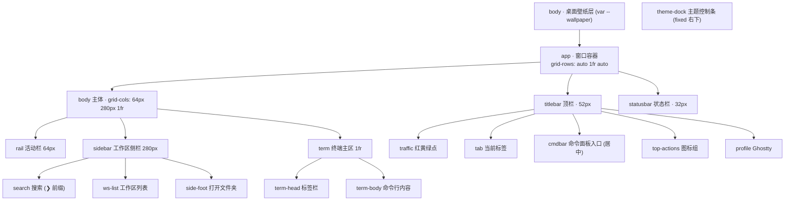

# Twilight Terminal 设计规范（AI 实现说明）

> 这份文档写给 AI 读。目标：读完能 1:1 实现一个带「单色驱动主题引擎」的透明终端 App 界面。所有尺寸、色值算法、组件状态、交互行为都已写死，照着做即可，不需要再做设计决策。
>
> 参考实现：`twilight-terminal-redesign.html`（单文件，纯 HTML+CSS+JS，无依赖，无构建）。本规范与该文件一致。

---

## 0. 一句话定位

一个深色、半透明、透出桌面壁纸的终端 App 界面（Warp 风格）。视觉灵感来自「日落天鹅湖」——暖色落日光 + 冷色水面。**核心特性是单色驱动主题：用户给任意一个颜色，用色彩理论现场派生出整套主题**（强调色 + 终端 16 色 + 日落壁纸渐变）。

设计签名有三个，实现时必须保留：

1. **`❯` prompt 符号贯穿全局**——搜索框、工作区副标题、命令行前缀都用它，让「这是终端工具」从设计本身长出来。
2. **抽象日落构图**——壁纸的太阳永远落在右下角地平线，正文区左侧压暗（清晰）、右侧通透（透壁纸）。
3. **单色驱动**——整个视觉系统由一个种子色（seed）生成，换色即换整套。

---

## 1. 技术约束

| 项 | 要求 |
|:--|:--|
| 形态 | 单个 `.html` 文件，内联 `<style>` 和 `<script>`，零外部 JS 依赖 |
| 字体 | 仅用 Google Fonts：`Space Grotesk`（UI）+ `JetBrains Mono`（等宽/数据） |
| 颜色 | CSS 自定义属性 + `color-mix()` + `hsl()`；主题变量由 JS 注入 `:root` |
| 兼容 | 现代浏览器（需支持 `color-mix`、`backdrop-filter`）；响应式降级到移动端 |
| 无障碍 | 可见键盘焦点、`prefers-reduced-motion`、`aria-label` |

---

## 2. 整体布局

### 2.1 结构树



### 2.2 窗口容器 `.app`

```
宽    min(1360px, 100vw - 60px)
高    min(840px, 100vh - 60px)
圆角  16px
布局  display:grid; grid-template-rows: auto 1fr auto;
背景  rgba(12,17,27,.05)         /* 极透，几乎全靠壁纸透出 */
阴影  0 50px 130px -25px rgba(0,0,0,.65),
      0 0 0 1px rgba(255,255,255,.10),      /* 描边 */
      inset 0 1px 0 rgba(255,255,255,.09)   /* 顶部高光 */
居中  body 用 flex 居中
```

**关键**：`.app` 自身不要加 `backdrop-filter`（见 §6 透明分层原则）。

---

## 3. 配色系统（核心）

### 3.1 固定的中性变量（写死在 `:root`）

```css
--text:      #f3f5fb;   /* 正文主色 */
--text-dim:  #c8cfdf;   /* 次要文字 */
--text-faint:#969db2;   /* 占位/弱化 */

/* 玻璃面板：半透明深色，靠 scrim 压住壁纸保证可读 */
--glass-side:   rgba(16,22,34,.42);   /* 侧栏 */
--glass-rail:   rgba(10,14,22,.38);   /* 活动栏 */
--glass-card:   rgba(36,46,68,.42);   /* 卡片/标签 */
--glass-card-h: rgba(48,62,90,.5);    /* 卡片 hover/active */
--top-glass:    rgba(14,19,29,.34);   /* 顶栏/状态栏 */
--hairline:     rgba(255,255,255,.10);/* 描边 */
--hairline-soft:rgba(255,255,255,.06);/* 弱描边 */
--scrim-1:      rgba(8,11,18,.62);    /* 终端区暗化-浓（左/正文侧） */
--scrim-2:      rgba(8,11,18,.22);    /* 终端区暗化-淡（右/日落侧） */

--radius:11px; --radius-sm:8px;
--mono:'JetBrains Mono',ui-monospace,monospace;
--sans:'Space Grotesk',-apple-system,system-ui,sans-serif;
```

### 3.2 主题变量（由 JS 注入，可被覆盖）

这 6 个变量是「主题」的全部，由种子色生成（见 §3.3）：

```css
--amber     /* 主强调色 = 种子色规整化（按钮、光标、active 标记） */
--amber-2   /* 强调高光态（时钟、高亮数字） */
--cyan      /* 次要色，互补偏冷（数据、徽章、链接） */
--green     /* 成功/路径色（prompt chip、目录） */
--magenta   /* 文件/强调色 */
--wallpaper /* 整张日落壁纸的 background 值 */
```

> 命名沿用 `--amber/--cyan` 等是历史原因（最初是暮光主题）。它们是**语义槽位**，不代表实际颜色——换主题后 `--amber` 可能是绿色。实现时保留这套命名即可。

### 3.3 单色驱动算法（必须精确实现）

输入一个 hex 种子色，输出上述 6 个变量 + Warp 导出色。这是整个系统的心脏。

**色彩工具函数**（HSL 在此用色相环角度运算，比 RGB 直观）：

```js
const clamp=(v,a,b)=>Math.max(a,Math.min(b,v));

// hex → {h:0-360, s:0-100, l:0-100}
function hexToHsl(hex){
  hex=hex.replace('#','');
  if(hex.length===3)hex=hex.split('').map(c=>c+c).join('');
  const r=parseInt(hex.slice(0,2),16)/255, g=parseInt(hex.slice(2,4),16)/255, b=parseInt(hex.slice(4,6),16)/255;
  const mx=Math.max(r,g,b), mn=Math.min(r,g,b), d=mx-mn;
  let h=0; if(d){ if(mx===r)h=((g-b)/d)%6; else if(mx===g)h=(b-r)/d+2; else h=(r-g)/d+4; h*=60; if(h<0)h+=360; }
  const l=(mx+mn)/2, s=d?d/(1-Math.abs(2*l-1)):0;
  return {h, s:s*100, l:l*100};
}

const hsl =(h,s,l)=>`hsl(${((h%360)+360)%360} ${clamp(s,0,100).toFixed(1)}% ${clamp(l,0,100).toFixed(1)}%)`;
const hsla=(h,s,l,a)=>`hsl(${((h%360)+360)%360} ${clamp(s,0,100).toFixed(1)}% ${clamp(l,0,100).toFixed(1)}% / ${a})`;

// 色相按最短环形路径插值：把 a 拉向锚点 b，比例 t
function lerpHue(a,b,t){ let d=((b-a+540)%360)-180; return a+d*t; }

// HSL → #hex（导出 Warp 用）
function hslToHex(h,s,l){
  h=((h%360)+360)%360; s=clamp(s,0,100)/100; l=clamp(l,0,100)/100;
  const c=(1-Math.abs(2*l-1))*s, x=c*(1-Math.abs((h/60)%2-1)), m=l-c/2;
  let r,g,b;
  if(h<60){r=c;g=x;b=0}else if(h<120){r=x;g=c;b=0}else if(h<180){r=0;g=c;b=x}
  else if(h<240){r=0;g=x;b=c}else if(h<300){r=x;g=0;b=c}else{r=c;g=0;b=x}
  const f=v=>Math.round((v+m)*255).toString(16).padStart(2,'0');
  return '#'+f(r)+f(g)+f(b);
}
```

**主题生成**（`genTheme(seed)`）：

```js
function genTheme(seed){
  const {h,s,l}=hexToHsl(seed);
  const S=clamp(s,42,96);   // 饱和度护栏：防灰、防过艳

  // —— UI 强调色：高亮度保证暗背景可读 ——
  const amber  = hsl(h, S, clamp(l,58,70));                       // 主色
  const amber2 = hsl(h, clamp(S-12,40,88), clamp(l+15,72,86));    // 高光
  const cyan   = hsl(h+168, clamp(S-6,46,82), 70);               // 互补偏冷
  const green  = hsl(h+96,  clamp(S-12,40,76), 69);             // 类比 +96°
  const magenta= hsl(h-46,  clamp(S-4,46,82), 72);             // 类比 -46°

  // —— 日落壁纸：暖光源(seed) + 冷天空/水面(锚定蓝紫) ——
  // 冷暖对比是「日落」氛围的本质，所以天空/水面强制拉向蓝紫，换任何种子都还是日落
  const skyH   = lerpHue(h,250,0.72);   // 天空 → 蓝紫
  const waterH = lerpHue(h,218,0.78);   // 水面 → 深蓝
  const sunS   = clamp(S+4,55,98);
  const wall=[
    `radial-gradient(28% 36% at 82% 64%, ${hsla(h, clamp(S-18,30,70), 92, .95)}, transparent 62%)`,  // 太阳核心
    `radial-gradient(72% 58% at 84% 66%, ${hsla(h, sunS, 62, .72)}, transparent 68%)`,                // 落日光晕
    `linear-gradient(180deg,`+
      `${hsl(skyH,    clamp(S*0.5,18,55), 16)} 0%,`+
      `${hsl(skyH-12, clamp(S*0.55,20,58), 24)} 20%,`+
      `${hsl(lerpHue(h,skyH,.5), clamp(S*0.6,28,66), 40)} 40%,`+
      `${hsl(h,       clamp(sunS*0.82,45,92), 54)} 56%,`+        // 地平线暖光带
      `${hsl(lerpHue(h,waterH,.5), clamp(S*0.55,26,64), 38)} 64%,`+
      `${hsl(waterH,  clamp(S*0.5,24,58), 26)} 76%,`+
      `${hsl(waterH+4,clamp(S*0.52,24,60), 18)} 88%,`+
      `${hsl(waterH+6,clamp(S*0.5,22,58), 12)} 100%)`
  ].join(',');

  // —— Warp 终端 16 色（导出用，见 §7）——
  // ANSI 语义色锚定标准色相，只被 seed 轻染 12%，保证「红是红、绿是绿」
  const tint=(anchor,t=0.12)=>lerpHue(anchor,h,t);
  const TS=clamp(S-6,48,78);
  const warp={
    accent:     hslToHex(h, S, clamp(l,58,70)),
    background: hslToHex(waterH+4, clamp(S*0.45,18,46), 9),  // 取水面深色作底，与壁纸同源
    foreground: hslToHex(h, 12, 94),
    normal:{
      black:   hslToHex(waterH, clamp(S*0.4,14,40), 18),
      red:     hslToHex(tint(358), TS, 64),
      green:   hslToHex(tint(138), TS, 56),
      yellow:  hslToHex(h, S, clamp(l,58,70)),
      blue:    hslToHex(tint(210), TS, 64),
      magenta: hslToHex(tint(305), TS, 68),
      cyan:    hslToHex(tint(182), TS, 62),
      white:   hslToHex(h, 10, 82),
    },
    bright:{
      black:   hslToHex(waterH, clamp(S*0.3,10,34), 40),
      red:     hslToHex(tint(358), TS, 74),
      green:   hslToHex(tint(138), TS, 67),
      yellow:  hslToHex(h, clamp(S-12,40,88), clamp(l+15,72,86)),
      blue:    hslToHex(tint(210), TS, 74),
      magenta: hslToHex(tint(305), TS, 78),
      cyan:    hslToHex(tint(182), TS, 72),
      white:   hslToHex(h, 8, 96),
    }
  };

  return {amber,amber2,cyan,green,magenta,wall,warp};
}
```

> **设计原理（为什么这么写，AI 改动时不要破坏这些）**
> - **饱和度/亮度护栏**：所有 UI 强调色锁在 58–72% 亮度。这样即使种子色很暗（如纯红 `#ff3b3b`）或很灰，落到暗背景上也可读。
> - **色相环派生**：次要色按固定角度偏移（互补 +168°、类比 +96°/-46°）。任何种子出来的配色都和谐，不会撞色。
> - **壁纸冷暖分离**：光源永远是种子色，但天空/水面**强制锚定蓝紫/深蓝**。这是「日落天鹅湖」的本质（暖光 vs 冷水）；少了这条，换个绿色种子就变成单色糊一片，不再是日落。
> - **ANSI 语义色锚定**：终端里 red/green/blue 有强语义（`git diff`、`ls`、报错）。若像 UI 色那样纯色相偏移，蓝色主题下「绿色」会变品红，导致 `git diff` 的新增行显示成品红。所以语义色锚定到标准色相（red≈358°、green≈138°…），只被种子色轻染 12%——既呼应主题，又保持「红是红」。这是可用性底线，不能为了视觉统一牺牲。

### 3.4 应用主题

```js
function applySeed(seed){
  const t=genTheme(seed);
  const r=document.documentElement.style;
  r.setProperty('--amber',t.amber);
  r.setProperty('--amber-2',t.amber2);
  r.setProperty('--cyan',t.cyan);
  r.setProperty('--green',t.green);
  r.setProperty('--magenta',t.magenta);
  r.setProperty('--wallpaper',t.wall);
  // … 同步 UI 反馈（色值框、选中态），持久化 localStorage('term-seed')
}
```

`body { background: var(--wallpaper); transition: background .5s ease; }` —— 换主题时壁纸平滑过渡。

---

## 4. 字体系统

```
引入  <link href="...Space+Grotesk:wght@400;500;600;700
              &family=JetBrains+Mono:wght@400;500;600">

角色分工：
  Space Grotesk  → 所有 UI 文字（标签、按钮、工作区名）
  JetBrains Mono → 所有「数据」：时间戳、路径、ttys011、118×37、
                   命令行正文、hex 色值、状态栏

字号刻度：
  11px    section 小标题 / 状态栏 / kbd
  11.5px  工作区副标题 / 终端标签
  12px    prompt chip
  13px    侧栏按钮 / profile / 命令面板标签
  13.5px  工作区名 / 终端正文 / 搜索输入
  font-weight 用 500/600 拉开层次；小标题用 600 + letter-spacing .09em + uppercase
```

**为什么分两个字体**：等宽字体承担「这是终端、这是真实数据」的语义。时间戳、窗口尺寸、路径用 mono，UI 标签用 sans，读者一眼能分清「系统输出」和「界面控件」。

---

## 5. 组件规范（逐个）

### 5.1 顶栏 `.titlebar` — 高 52px

```
背景  var(--top-glass) + backdrop-filter: blur(22px)
布局  flex, align-items:center, gap:16px, padding:0 16px

[traffic]  红黄绿三个 12px 圆点（#ff5f57 / #febc2e / #28c840）
[tab]      当前标签：34px 高，glass-card 底，终端图标(amber)+「Terminal」
[cmdbar]   命令面板入口，margin:0 auto 居中，见下
[top-actions] 4 个 32px 图标按钮（代码、网格、月亮、地球）
[profile]  «绿点 + Ghostty + 下拉箭头»，glass-card 底
```

**命令面板入口 `.cmdbar`**（重点，原设计这里很糊，必须做清晰）：

```
高 34px, min-width 340px, max-width 430px
背景  color-mix(in srgb, var(--amber) 12%, transparent)
描边  1px color-mix(in srgb, var(--amber) 32%, transparent)
内容（从左到右）：
  ☀ 日落图标(amber, 16px)  →  时钟「11:15」(mono, amber-2)
  →  竖分隔线  →  「打开命令面板」(text-dim)
  →  kbd「⇧⌘P」(右对齐, mono, 黑底胶囊)
hover：背景和描边的 amber 比例都提高
```

### 5.2 活动栏 `.rail` — 宽 64px

```
背景  var(--glass-rail) + blur(26px)
flex column, align-items:center, padding:14px 0, gap:6px

按钮 .rail-btn  38×38, 圆角 10px, 图标 19px, 色 text-faint
  hover   背景 rgba(255,255,255,.08), 色 text-dim
  active  色 amber + 左侧发光竖条：
          ::before 定位在 left:-14px, 宽3px 高20px,
          背景 amber, box-shadow 0 0 10px amber
图标顺序：工作区(active) / 网格 / 书签 / [spacer 推到底] / 设置
```

### 5.3 工作区侧栏 `.sidebar` — 宽 280px

```
背景  var(--glass-side) + blur(30px) saturate(125%)
      （比终端区不透明，保证列表清晰）
flex column

▸ 搜索框 .search  高38px
    [❯ prompt(amber,mono)]  [input 占满]  [/ slash 提示(框)]
    底 rgba(0,0,0,.2), 描边 hairline
    placeholder「筛选工作区…」

▸ 分区标题 .side-section
    左「工作区」(11px, uppercase, .09em, text-faint)
    右 计数胶囊「2」(mono, 黑底)

▸ 列表 .ws-list  (每项 .ws)
    高 padding:9px 11px, gap:11px, 圆角 8px
    [图标 34×34 圆角9]  [名称+副标题]  [pin 图标(可选)]
    图标 .a → amber 渐变底; .b → cyan 渐变底
    名称行：粗体 + 可选徽章「工作流」(cyan 底)
    副标题：mono, 「❯ liaojingyu · ~」格式, ❯ 用 amber
    hover   背景 glass-card
    active  背景 glass-card-h + 描边 hairline + 左侧 amber 发光竖条
            (同 rail active，但 ::before 在 left:0)

▸ 底部 .side-foot
    [打开文件夹…按钮 (flex:1)]  [远程图标按钮 (38×38 方)]
    hover 时描边变 amber
```

### 5.4 终端主区 `.term` — 宽 1fr（最透）

```
背景  rgba(8,12,20,.06)  ← 最低不透明度，最大限度透壁纸

可读性双保险（关键，不能省）：
  .term::before  全覆盖 scrim 渐变，左浓右淡（与日落构图配合）：
    linear-gradient(100deg,
      var(--scrim-1) 0%, var(--scrim-1) 14%,   /* 正文侧压暗 */
      var(--scrim-2) 46%, rgba(8,11,18,.04) 74%, transparent 100%)  /* 日落侧通透 */
  .term-body  text-shadow: 0 1px 4px rgba(0,0,0,.6)  /* 每行字单独脱离背景 */

  .term::after  地平线暖光：底部 2px 高，
    linear-gradient(90deg, transparent,
      color-mix(--amber 50%) 55%, color-mix(--amber-2 65%) 75%, transparent)

▸ term-head 标签栏  padding:11px 16px, 下边框 hairline-soft
    [term-tab「❯ ~ — zsh」(mono)]  [grow]  [新建+]  [横/竖分屏图标]

▸ term-body 正文  padding:22px 26px, mono, 13.5px, line-height:1.85
    内容用语义 class 着色（见下），模拟真实 shell 会话
```

**终端正文配色 class**：

```css
.muted{color:var(--text-dim)}    /* 系统提示 */
.dim{color:var(--text-faint)}    /* 文件大小等弱信息 */
.c-amber{color:var(--amber)}     .c-cyan{color:var(--cyan)}
.c-green{color:var(--green)}     .c-mag{color:var(--magenta)}
.c-text{color:var(--text)}

/* prompt 行 */
.pchip      /* 路径胶囊，green 系：~ */
.pchip.dir  /* 当前目录胶囊，amber 系 */
.arrow      /* ❯ 符号, amber 粗体 */
.cursor     /* 闪烁光标：8×17 amber 方块, blink 1.1s steps(2) */
```

示例会话内容（可照搬，体现配色）：`git status` → 分支/clean 提示；`ll` → 目录(green)/文件(magenta) 列表；末行 prompt + 闪烁光标。

### 5.5 状态栏 `.statusbar` — 高 32px

```
背景  var(--top-glass) + blur(22px), 上边框 hairline-soft
mono, 11.5px, text-dim

左：[●绿点 本地 Shell] [zsh 5.9] [node v22.3.0]
[grow]
右：[⎇ main(amber)] [UTF-8] [118 × 37]
   («k» 类的键名用 text-faint，值用 text-dim)
```

### 5.6 主题控制条 `.theme-dock`（核心交互）

```
position:fixed; right:26px; bottom:26px; z-index:50
胶囊形：圆角 40px, padding:9px 13px, gap:10px
背景  rgba(14,19,29,.55) + blur(24px) saturate(130%)
描边 hairline, 阴影 + inset 高光

内容（从左到右）：
  [「预设」标签(mono, faint)]
  [5 个预设色点 .swatch]
  [分隔线 .dock-sep]
  [自定义取色器 .picker (彩虹环包 input[type=color])]
  [hex 输入框 .seed-input (可手输, 72px)]
  [分隔线]
  [「⬇ 导出 Warp」按钮 .export-btn (amber 实底)]

预设色点 .swatch  24×24 圆
  背景 var(--sw)：linear-gradient(140deg, 种子色 30%, 同色相加深 hsl(h,s,34%))
  hover  scale(1.14)
  active 白色 2px 描边 + 外圈 ::after 白色细环
  5 个种子：#ffb066 暮光 / #7af0c0 极光 / #5cc8ff 深海 /
            #ff9ec4 樱绯 / #ff7a59 余烬

取色器 .picker  26×26 圆
  背景 conic-gradient 彩虹环, 内嵌画笔图标
  input[type=color] 绝对定位铺满, opacity:0 (点击唤起系统拾色器)
  无预设选中时 .active (说明当前是自定义色)

hex 输入框 .seed-input
  mono, 黑底, 圆角6, 宽72px, text-transform:lowercase
  focus 时描边变 amber
  输入合法 hex (#RGB 或 #RRGGBB) 即实时 applySeed

导出按钮 .export-btn
  amber 实底 (color-mix amber 90% black) + 深色文字
  hover translateY(-1px) + amber 投影
```

### 5.7 Toast 提示 `.toast`

```
position:fixed; left:50%; bottom:84px; 居中
默认 opacity:0 + translateY(12px)，.show 时淡入归位
背景 rgba(14,19,29,.92) + blur(20px)
内容：「已导出 <文件名(amber,mono)> · 放进主题目录即可用」
     + 一行可全选的命令 .tcmd:
       「mv ~/Downloads/<file> ~/.warp/themes/」
4.2s 后自动消失
```

---

## 6. 透明分层原则（最重要的实现纪律）

> **透明 + 模糊只让一层做。多层叠加会双重模糊、透明度相乘变暗、颜色发灰。**

本设计里的分层策略：

| 层 | 不透明度 | backdrop-filter | 说明 |
|:--|:--|:--|:--|
| `body`（壁纸） | 实色渐变 | 无 | 桌面壁纸，唯一的「背景源」 |
| `.app` | `.05` 极透 | **无** | 容器只透，不糊 |
| `.sidebar` | `.42` | blur(30px) | 列表需清晰，不透明度较高 |
| `.term` | `.06` 最透 | **无**，靠 scrim | 最大透壁纸，可读性交给 scrim+text-shadow |
| `.titlebar/.statusbar` | `.34` | blur(22px) | chrome 适度模糊 |

**两条铁律**：
1. 嵌套元素不要层层加 `backdrop-filter`——只在「直接盖在壁纸上」的面板加，且每个区域最多一层。
2. 终端正文区**不靠模糊**保证可读，靠 **scrim 渐变（左浓右淡）+ 逐行 text-shadow**。这样能做到「很透」和「字很清楚」同时成立。

> 若这个界面要落到真实终端软件（如 Warp）：透明/模糊交给**软件的窗口设置**（系统级，原生不卡），主题文件只管颜色。详见 §7。

---

## 7. Warp 主题导出（落地用）

预览器里调出满意的颜色后，「导出 Warp」按钮把 `genTheme(seed).warp` 拼成 Warp 主题 YAML 并下载。

**YAML 结构**：

```yaml
name: <主题名>
accent: '<warp.accent>'
background: '<warp.background>'
foreground: '<warp.foreground>'
details: darker
terminal_colors:
  normal:  { black, red, green, yellow, blue, magenta, cyan, white }
  bright:  { black, red, green, yellow, blue, magenta, cyan, white }
```

**导出实现要点**：
- 用 `Blob` + `URL.createObjectURL` + `<a download>` 触发下载，文件名 `<slug>.yaml`。
- 预设色映射中文名（`#ffb066`→`Twilight 暮光`…），自定义色用 `Custom <hex>`。
- 导出后弹 toast，给出 `mv ~/Downloads/xxx.yaml ~/.warp/themes/` 安装命令。

**与预览一致性**：YAML 的颜色和预览必须同源——都走 `genTheme` 的 `hslToHex`，预览什么色导出就什么色，不能两套算法。

---

## 8. 交互与状态汇总

| 控件 | 事件 | 行为 |
|:--|:--|:--|
| 预设色点 | click | `applySeed(种子色)`，同步取色器值与选中态 |
| 取色器 | input | `applySeed(选中色)`，实时重算整个界面 |
| hex 输入框 | input | 合法 hex 即 `applySeed`；blur 时回填当前 seed |
| 导出按钮 | click | 生成 YAML 下载 + toast |
| 启动 | load | 读 `localStorage('term-seed')`，无则默认 `#ffb066` |

**质量底线（必须实现）**：
- `*:focus-visible { outline:2px solid var(--amber); outline-offset:2px }`
- `@media (prefers-reduced-motion:reduce)` → 关闭光标闪烁和壁纸过渡
- `@media (max-width:760px)` → 隐藏 rail/sidebar/cmdbar，dock 移到 `right:12px;bottom:12px`

---

## 9. 实现顺序建议

1. 搭骨架：HTML 结构 + grid 布局 + 固定中性变量，先用默认主题硬编码跑通视觉。
2. 写 `genTheme` 算法 + `applySeed`，把主题变量改成 JS 注入。
3. 做 dock 交互（预设/取色器/hex 输入）+ localStorage。
4. 做 scrim/text-shadow 可读性方案，反复对比「透」和「清楚」的平衡。
5. 做 Warp 导出 + toast。
6. 补无障碍、响应式、reduced-motion。
7. 自检：用绿、紫、红等极端种子色各生成一次，确认配色都和谐、终端语义色不失真、文字都可读。

---

## 10. 验收清单

- [ ] 任选一个颜色（含极端的暗红、灰蓝），整个界面生成协调主题，文字均可读
- [ ] 壁纸始终是「右下角日落 + 冷色天空水面」构图，不是单色糊一片
- [ ] 终端区很透能看见壁纸，但每行命令文字清晰（scrim + text-shadow 生效）
- [ ] `git diff`/`ls` 类语义色在任何主题下「红是红、绿是绿」
- [ ] 导出的 YAML 颜色与预览完全一致
- [ ] 刷新页面后保留上次选的颜色
- [ ] 键盘 Tab 有可见焦点；移动端布局不破；reduced-motion 下无闪烁
- [ ] 全程没有嵌套 `backdrop-filter` 叠加（透明只一层）
